# 🕐 Timely

> Sistema de registo de ponto para a **Mindshaker - Serviços Informáticos, Lda.**  
> Suporta marcação de ponto manual (web), por biometria (sensor ESP32 com leitor de impressão digital) e gestão completa de logs por parte dos administradores.

---

## 📋 Índice

- [Funcionalidades](#-funcionalidades)
- [Tecnologias](#-tecnologias)
- [Requisitos](#-requisitos)
- [Instalação](#-instalação)
- [Configuração](#-configuração)
- [Estrutura do Projeto](#-estrutura-do-projeto)
- [Perfis de Utilizador](#-perfis-de-utilizador)
- [Fluxo de Aprovação](#-fluxo-de-aprovação)
- [Exportação](#-exportação)
- [Integrações](#-integrações)
- [Comandos Agendados](#-comandos-agendados)
- [Segurança](#-segurança)

---

## ✨ Funcionalidades

### 👤 Utilizador Normal

| Funcionalidade | Descrição |
|---|---|
| **Marcação de entrada** | Registo de entrada via botão na página inicial |
| **Marcação de saída** | Registo de saída com cálculo automático de horas trabalhadas |
| **Sensor biométrico** | Entrada e saída registadas automaticamente pelo ESP32 com leitor de impressão digital |
| **Ver logs** | Visualização dos seus próprios registos de ponto (aprovados) com filtros por mês e dia |
| **Eliminar log** | Eliminação de um registo próprio |
| **Pedir inserção** | Submissão de pedido para adicionar um log em falta — requer aprovação de admin |
| **Pedir edição** | Submissão de pedido para editar um log existente — requer aprovação de admin |
| **Exportar logs** | Exportação dos seus logs em `.xlsx` |
| **Notificações de email** | Ativar ou desativar emails de notificação no perfil |
| **Perfil** | Edição de nome, email e hora de início de almoço |

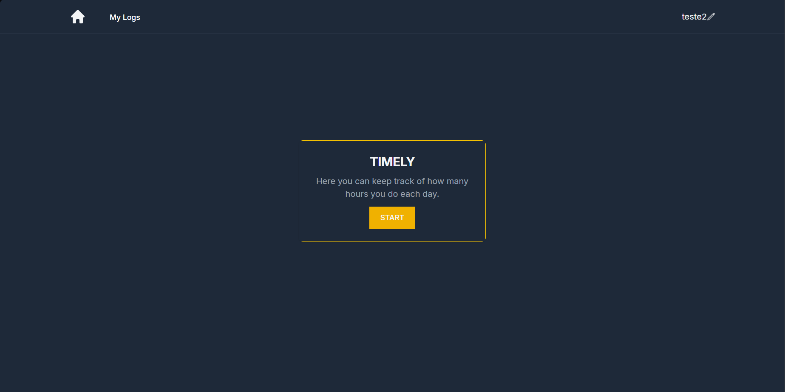
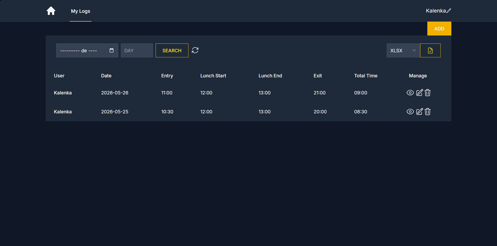

### 🔧 Worker

| Funcionalidade | Descrição |
|---|---|
| **Marcação de entrada/saída** | Igual ao utilizador normal — via web ou sensor biométrico |
| **Ver logs** | Visualização dos seus próprios registos de ponto (aprovados) |
| **Inserir log** | Inserção direta de logs em falta **sem necessidade de aprovação** |
| **Editar log** | Edição direta dos seus logs **sem necessidade de aprovação** |
| **Eliminar log** | Eliminação de um registo próprio |
| **Exportar logs** | Exportação dos seus logs em `.xlsx` |
| **Lembrete de email** | Recebe emails de lembrete quando tem logs em falta |
| **Perfil** | Edição de nome, email e hora de início de almoço |

> O worker **não envia nem recebe** emails de pedidos de inserção ou edição — as suas alterações são aplicadas diretamente, sem passar pelo fluxo de aprovação.

### 🛡️ Administrador

| Funcionalidade | Descrição |
|---|---|
| **Ver todos os logs** | Listagem de logs de todos os utilizadores com filtros por nome, mês e dia |
| **Editar log** | Edição direta de qualquer log sem necessidade de aprovação |
| **Eliminar log** | Eliminação de qualquer log |
| **Criar log** | Inserção de log para qualquer utilizador com aprovação imediata |
| **Aprovar/Recusar pedidos** | Gestão de pedidos de inserção e edição submetidos por utilizadores normais — via email (link com expiração de 1h) ou painel |
| **Audit log** | Consulta do historial completo de alterações (`admin_logs`) com filtros por utilizador e mês |
| **Exportar logs** | Exportação profissional em `.xlsx` formatado (Mindshaker template) com múltiplos cenários |
| **Exportar utilizadores** | Exportação da lista de utilizadores em `.xlsx`|
| **Gestão de utilizadores** | Criação de utilizadores, alteração de tipo (admin/user/worker) |
| **Biometria** | Envio de comando MQTT para enroll ou eliminação de impressão digital no sensor ESP32 |

---

 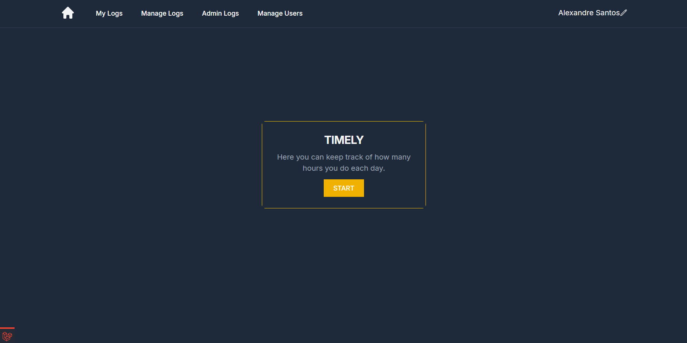
 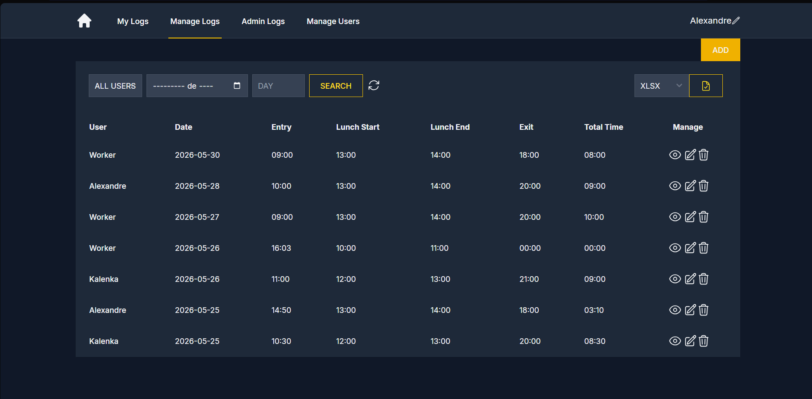
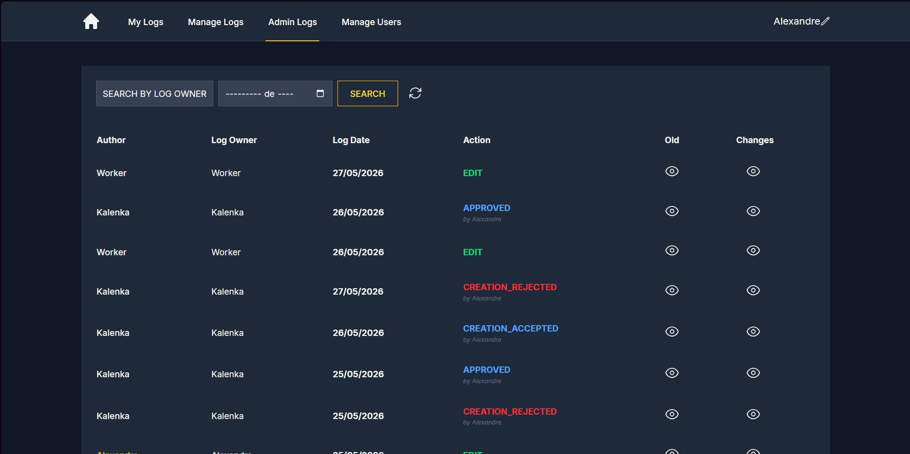

## 🛠️ Tecnologias

| Camada | Tecnologia |
|---|---|
| **Backend** | Laravel 12 / PHP 8.2 |
| **Frontend** | Blade + Tailwind CSS + Flowbite |
| **Base de dados** | MySQL / MariaDB |
| **Autenticação** | Laravel Breeze |
| **Email** | SMTP via Laravel Mail (Mailable classes) |
| **Exportação** | PhpSpreadsheet (`.xlsx`) |
| **Hardware** | ESP32 + Sensor biométrico AS608 |
| **Comunicação IoT** | MQTT over TLS (`php-mqtt/client`) |
| **Lembretes de tarefas** | Laravel Scheduler (Artisan commands) |

---

## 📦 Requisitos

- PHP >= 8.2
- Composer
- Node.js >= 18 + NPM
- MySQL / MariaDB
- Extensão PHP `zip` (para exportação em `.zip`)
- Extensão PHP `calendar` (para cálculo de feriados com `easter_days()`)
- Broker MQTT acessível (para biometria)

---

## 🚀 Instalação

```bash
# 1. Clonar o repositório
git clone https://github.com/AlexandreSantos10/laravel-clock-puncher.git
cd laravel-clock-puncher

# 2. Instalar dependências PHP
composer install

# 3. Instalar dependências JS
npm install && npm run build

# 4. Copiar ficheiro de ambiente
cp .env.example .env

# 5. Gerar chave da aplicação
php artisan key:generate

# 6. Configurar base de dados no .env e correr migrações
php artisan migrate

# 7. Iniciar servidor local
php artisan serve
```

---

## ⚙️ Configuração

### `.env` — variáveis necessárias

```env
APP_NAME=Timely
APP_URL=http://localhost:8000

DB_CONNECTION=mysql
DB_HOST=127.0.0.1
DB_PORT=3306
DB_DATABASE=timely
DB_USERNAME=root
DB_PASSWORD=

MAIL_MAILER=smtp
MAIL_HOST=smtp.example.com
MAIL_PORT=587
MAIL_USERNAME=your@email.com
MAIL_PASSWORD=yourpassword
MAIL_ENCRYPTION=tls
MAIL_FROM_ADDRESS=your@email.com
MAIL_FROM_NAME="Timely"

MQTT_HOST=your-broker-host
MQTT_PORT=8883
MQTT_USERNAME=your-mqtt-username
MQTT_PASSWORD=your-mqtt-password
```

### `config/mqtt.php`

Ficheiro de configuração MQTT (incluído no projeto):

```php
return [
    'host'     => env('MQTT_HOST'),
    'port'     => env('MQTT_PORT', 8883),
    'username' => env('MQTT_USERNAME'),
    'password' => env('MQTT_PASSWORD'),
];
```

---

## 🗂️ Estrutura do Projeto

```
app/
├── Console/Commands/
│   ├── CheckForgottenLog.php        # Lembra utilizadores de logs em falta
│   └── ExpireOldRequests.php        # Expira pedidos pendentes após 1h
├── Http/
│   ├── Controllers/
│   │   ├── logscontroller.php       # CRUD de logs + clock in/out
│   │   ├── LogApprovalController.php# Aprovação/rejeição de pedidos
│   │   ├── ExportController.php     # Exportação xlsx/csv
│   │   ├── Esp32Controller.php      # Endpoint IoT do sensor
│   │   └── usercontroller.php       # Utilizadores + biometria
│   └── Middleware/
│       └── IsAdmin.php              # Protege rotas /admin/*
├── Mail/
│   ├── NewLogRequestMail.php
│   ├── NewLogStatusMail.php
│   ├── LogEditRequestMail.php
│   ├── LogStatusUpdatedMail.php
│   ├── UserLogConfirmationMail.php
│   └── LembretePontoMail.php
└── Models/
    ├── Logs.php
    ├── User.php
    ├── LogApproval.php
    └── AdminLog.php

routes/
├── web.php       # Todas as rotas web
└── console.php   # Scheduler

resources/views/
├── admin/
│   ├── logs.blade.php
│   ├── editlog.blade.php
│   ├── looklog.blade.php
│   ├── createlogview.blade.php
│   ├── admin_logs.blade.php
│   ├── users.blade.php
│   ├── action_result.blade.php
│   └── export_confirm.blade.php
└── user/
    ├── home.blade.php
    ├── clockfinish.blade.php
    ├── clockfinished.blade.php
    ├── logs.blade.php
    ├── editlog.blade.php
    ├── looklog.blade.php
    └── createlogview.blade.php
```

---

## 👥 Perfis de Utilizador

O sistema tem três tipos de utilizador controlados pelo campo `tipo` na tabela `users`:

| Campo | Valor | Inserção/Edição de logs | Fluxo de aprovação | Emails de lembrete | Emails de pedidos |
|---|---|---|---|---|---|
| `tipo` | `user` | Requer aprovação de admin | ✅ Sim | ✅ Sim | ✅ Sim |
| `tipo` | `worker` | Direta, sem aprovação | ❌ Não | ✅ Sim | ❌ Não |
| `tipo` | `admin` | Direta, sem aprovação | ❌ Não | ❌ Não | ✅ Recebe pedidos |

As rotas `/admin/*` são protegidas pelo middleware `is_admin` que devolve `403` imediatamente caso um utilizador normal ou worker tente aceder.

---

 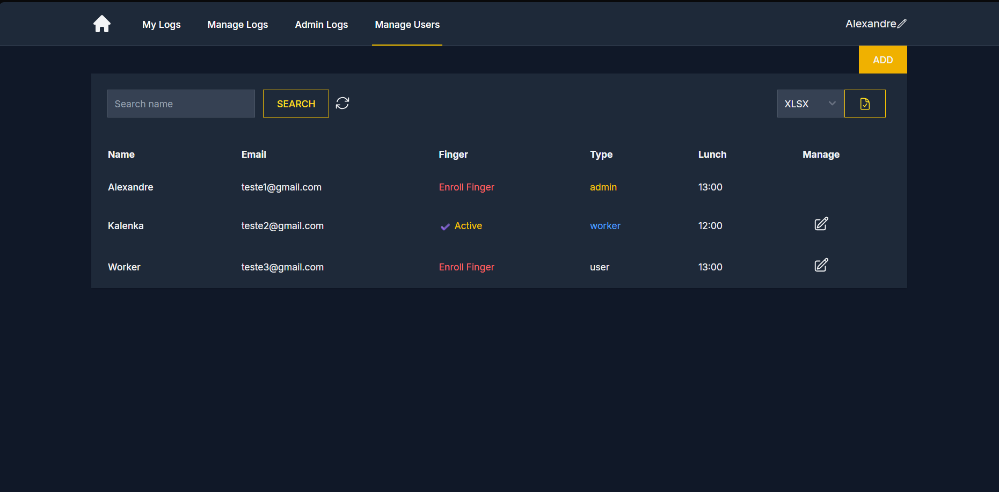

## 🔄 Fluxo de Aprovação

> **Nota:** O fluxo de aprovação aplica-se **apenas a utilizadores com `tipo = user`**. Workers e admins não passam por este processo.

### Inserção de novo log (pelo utilizador)

```
Utilizador submete log
        ↓
Log criado com status = 'pending'
        ↓
Email enviado ao utilizador (confirmação) + admins (link aprovar/recusar)
        ↓
Admin clica no link (válido por 1 hora)
   ├── Aprovado → status = 'approved', utilizador notificado
   ├── Recusado → status = 'rejected', utilizador notificado
   └── Expirado → log eliminado, registado em admin_logs como EXPIRED
```

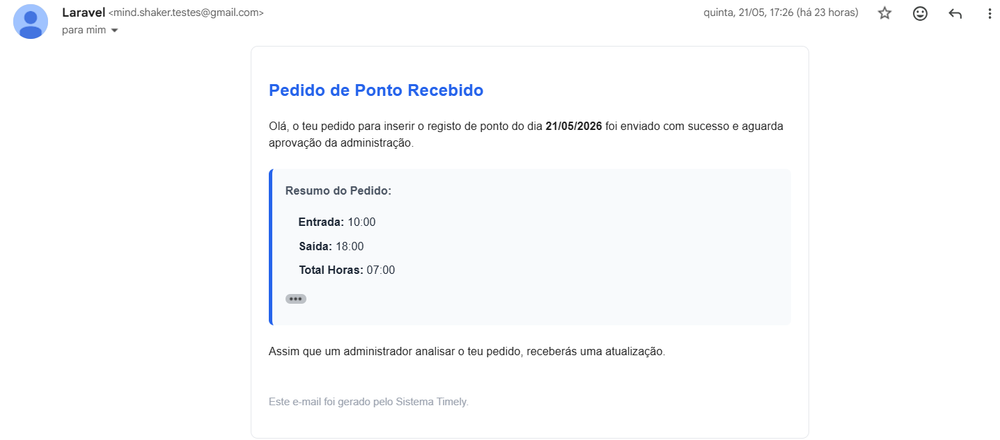
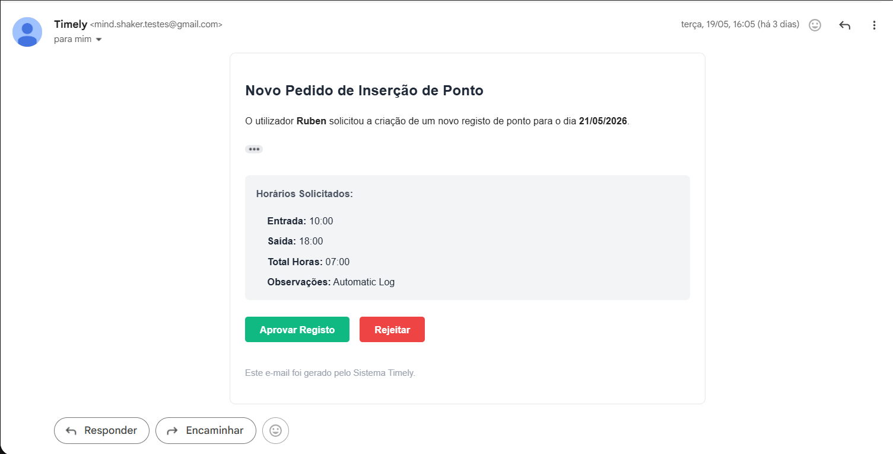
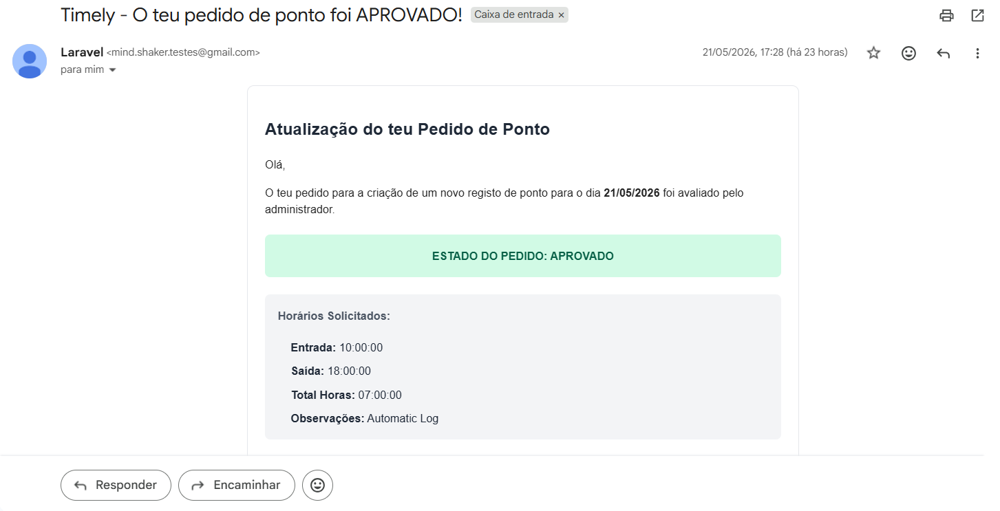

### Edição de log existente (pelo utilizador)

```
Utilizador submete edição
        ↓
LogApproval criado com dados_novos + status = 'pending'
        ↓
Email enviado aos admins com link aprovar/recusar (válido 1 hora)
        ↓
Admin clica no link
   ├── Aprovado → log atualizado, utilizador notificado
   ├── Recusado → log mantém dados originais, utilizador notificado
   └── Expirado → LogApproval marcado como 'expired', registado em admin_logs
```

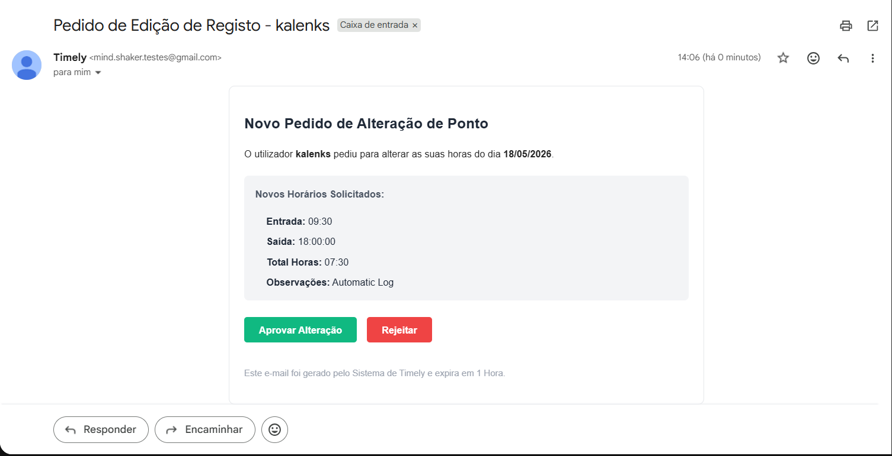
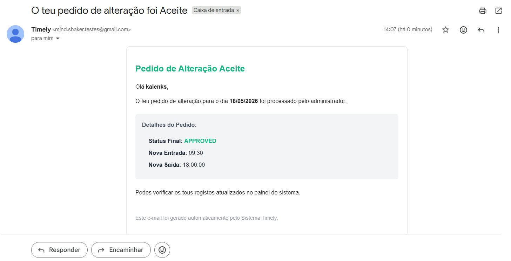

---

## 📊 Exportação

A exportação segue o template oficial Mindshaker com formatação profissional:

| Filtros ativos | Resultado |
|---|---|
| Mês + Pessoa | 1 ficheiro `.xlsx` com 1 tab para esse mês |
| Só Mês | 1 ficheiro `.xlsx` com 1 tab por utilizador |
| Só Pessoa | 1 ficheiro `.xlsx` com 1 tab por mês (apenas meses com logs) |
| Sem filtros | `.zip` com 1 ficheiro por utilizador, cada um com tabs mensais |

**Formatação do `.xlsx`:**
- Fundo amarelo `#FEF2CB` nos cabeçalhos
- Fins de semana a cinza escuro `#BFBFBF`
- Feriados portugueses (fixos + Sexta-Feira Santa + Corpo de Deus) a cinza claro `#D8D8D8`
- Fórmula de total de horas com desconto correto de almoço (apenas se o horário cruzar a janela de almoço)
- Linha de **Total mensal** e **Média diária** no fim de cada tab
- Antes de exportar, o sistema verifica se existem logs sem hora de saída e apresenta uma página de confirmação com os dias em falta

---

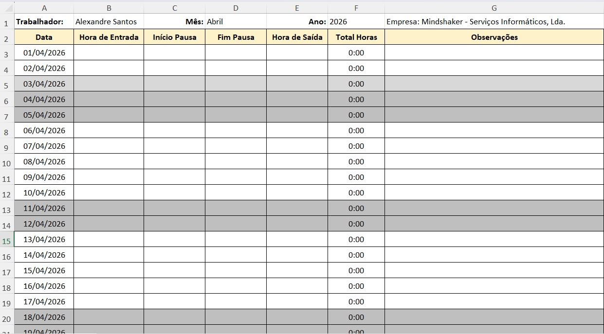

## 🤖 Integrações

### ESP32 + Sensor Biométrico

O sensor físico comunica com a aplicação através de dois mecanismos:

**MQTT (Admin → ESP32):**
- `Enroll/UserID` + `Enroll/Nome` — inicia o registo de impressão digital
- `Delete/UserID` — apaga a impressão digital do sensor

**HTTP POST (ESP32 → App):**
- `POST /esp32/ponto` — regista entrada ou saída automaticamente
- `POST /esp32/enroll-status` — confirma que o enroll foi bem sucedido
- `POST /esp32/delete-finger-status` — confirma eliminação da biometria

Estas rotas estão **fora** do middleware `auth` para serem acessíveis pelo hardware diretamente.


---

## 📧 Emails Enviados

| Evento | Destinatário | Tipo de utilizador | Classe |
|---|---|---|---|
| Novo pedido de log | Admins com notificações ativas | `user` apenas | `NewLogRequestMail` |
| Confirmação de submissão | Utilizador (se notificações ativas) | `user` apenas | `UserLogConfirmationMail` |
| Log aprovado/recusado | Utilizador (se notificações ativas) | `user` apenas | `NewLogStatusMail` |
| Pedido de edição | Admins com notificações ativas | `user` apenas | `LogEditRequestMail` |
| Edição aprovada/recusada | Utilizador (se notificações ativas) | `user` apenas | `LogStatusUpdatedMail` |
| Lembrete de ponto em falta | Utilizadores com notificações ativas | `user` e `worker` | `LembretePontoMail` |

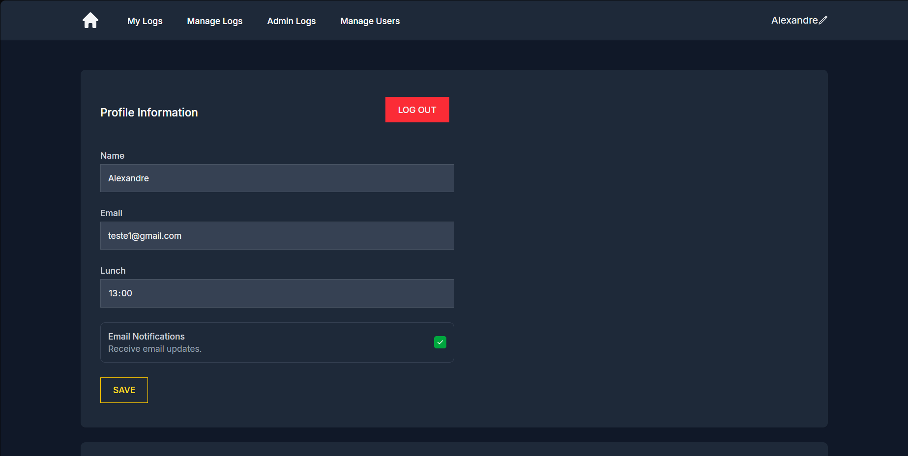

---

## 🔐 Segurança

| Mecanismo | Implementação |
|---|---|
| **Autenticação** | Laravel Breeze com sessão |
| **Autorização de rotas** | Middleware `IsAdmin` em todas as rotas `/admin/*` |
| **Autorização de recursos** | Verificação `user_id === Auth::id()` em looklog, editlog, deletelog |
| **Links de aprovação** | `URL::temporarySignedRoute()` com expiração de 1 hora |
| **CSRF** | Token em todos os formulários via `@csrf` |
| **Dark mode forçado** | Inline script + `color-scheme: dark` via CSS para garantir consistência em qualquer dispositivo |

---


## 📄 Licença

Projeto de uso interno — Mindshaker - Serviços Informáticos, Lda.